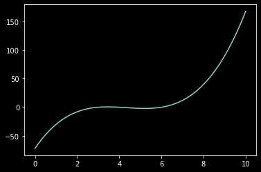

# Foundations and Core Concepts of PyTorch
## Module 6: Understanding Tensors


## Table of Contents
- [Introduction](#introduction)
- [Learning Objectives](#learning-objectives)
- [What Are Tensors?](#what-are-tensors)
- [From Tensors to Computational Graphs](#from-tensors-to-computational-graphs)
  - [Automatic Gradient Calculation](#automatic-gradient-calculation)
  - [Building Simple Networks](#building-simple-networks)
  - [Adding Weights to Networks](#adding-weights-to-networks)
  - [Scaling to Multi-Layer Networks](#scaling-to-multi-layer-networks)
- [Practical Implementation](#practical-implementation)
  - [Setting Up Your Environment](#setting-up-your-environment)
  - [Creating Basic Tensors](#creating-basic-tensors)
  - [Working with Gradients](#working-with-gradients)
  - [Building Multi-Layer Computational Graphs](#building-multi-layer-computational-graphs)
- [Summary](#summary)
- [Practice Exercises](#practice-exercises)

## Introduction

Welcome to the fundamental module on PyTorch Tensors! Tensors are the backbone of PyTorch, serving as the primary data structure for all operations. In this chapter, you'll gain a comprehensive understanding of what Tensors are, how they work, and why they're essential for deep learning.

## Learning Objectives

By the end of this chapter, you will be able to:
- ✅ Understand what tensors are and how they differ from NumPy arrays
- ✅ Create and manipulate tensors using PyTorch
- ✅ Implement automatic gradient calculation (autograd)
- ✅ Build simple computational graphs using tensors
- ✅ Understand how tensors form the foundation of neural networks

## What Are Tensors?

Tensors in PyTorch are specialized data structures similar to NumPy arrays but with two powerful additional capabilities:

1. **Automatic Gradient Calculation**: Tensors can track operations performed on them and automatically calculate gradients.
2. **GPU Acceleration**: Tensors can leverage GPU computing for faster calculations (we'll explore this in later chapters).

> 💡 **Key Concept**: A tensor is essentially a multi-dimensional array that knows its place in a computational graph, enabling automatic differentiation.

```python
# Example of creating a simple tensor
import torch
x = torch.tensor(5.5)
```

## From Tensors to Computational Graphs

### Automatic Gradient Calculation

One of the most powerful features of PyTorch tensors is their ability to automatically calculate gradients. This is achieved through the `requires_grad` parameter and the `backward()` function.

```python
# Creating a tensor with gradient tracking enabled
x = torch.tensor(2.0, requires_grad=True)

# Creating a function of x
y = (x-3) * (x-6) * (x-4)

# Calculating gradients
y.backward()

# Accessing the gradient
print(x.grad)  # Output: tensor(14.)
```

> ⚠️ **Important**: The gradient calculation gives us the slope of our function at the specific x-value we defined (in this case, at x=2).

For visualization, here's how the function looks across different x values:


### Building Simple Networks

Let's imagine a simple network with three nodes: an input node `x`, a hidden node `y`, and an output node `z`.

```
x → y → z
```

In PyTorch, we can implement this as:

```python
x = torch.tensor(1.0, requires_grad=True)
y = x**3
z = 5*y - 4
```

When we call `z.backward()`, PyTorch calculates all gradients through the computational graph:

```python
z.backward()
print(x.grad)  # Should equal 5*3*x**2 = 15 when x=1
```

> 📝 **Note**: This is a "forward pass" through our simple network. The "backward pass" happens when we call `backward()`, which calculates gradients.

### Adding Weights to Networks

In real neural networks, we have weights that need to be optimized during training. In our computational graph, weights can be represented as tensors with `requires_grad=True`.

The weights connect nodes in different layers and determine the strength of these connections. During training, these weights are adjusted based on gradient calculations.

### Scaling to Multi-Layer Networks

Networks become more powerful when we add multiple layers with multiple nodes. Let's consider a network with:
- 2 input nodes
- 2 hidden layer nodes
- 1 output node

## Practical Implementation

### Setting Up Your Environment

To work with PyTorch tensors, we first need to import the necessary packages:

```python
import torch
import numpy as np
import seaborn as sns
```

### Creating Basic Tensors

Let's start by creating simple tensors and performing basic operations:

```python
# Creating a tensor
x = torch.tensor(5.5)

# Simple calculations
y = x + 10
print(y)  # Output: tensor(15.5)

# Checking if gradient tracking is enabled
print(x.requires_grad)  # Output: False
```

### Working with Gradients

To enable gradient tracking:

```python
# Method 1: Enable gradient tracking after tensor creation
x.requires_grad_()

# Method 2: Enable gradient tracking during tensor creation
x = torch.tensor(2.0, requires_grad=True)
print(x.requires_grad)  # Output: True
```

Let's define a polynomial function and visualize it:

```python
def y_function(val):
    return (val-3) * (val-6) * (val-4)

# Visualizing the function
x_range = np.linspace(0, 10, 101)
y_range = [y_function(i) for i in x_range]
sns.lineplot(x=x_range, y=y_range)
```

Now let's calculate the gradient at a specific point:

```python
# Define y as a function of x
y = (x-3) * (x-6) * (x-4)

# Calculate gradients
y.backward()

# Print the gradient of x
print(x.grad)  # The slope at x=2
```


### Building Multi-Layer Computational Graphs

Now let's build a more complex computational graph that resembles a simple neural network:

```python
# Input layer nodes
x11 = torch.tensor(2.0, requires_grad=True)
x21 = torch.tensor(3.0, requires_grad=True)

# Hidden layer nodes
x12 = 5 * x11 - 3 * x21  # First hidden layer node
x22 = 2 * x11**2 + 2 * x21  # Second hidden layer node

# Output layer
y = 4 * x12 + 3 * x22  # Output node
```

This forms a simple neural network architecture:

```
Input Layer       Hidden Layer      Output Layer
   [x11] --------→ [x12] -------→
                 ↗        ↘         [y]
   [x21] --------→ [x22] -------→
```

To calculate gradients in this network:

```python
# Calculate gradients
y.backward()

# Print the gradients
print(f"Gradient of x11: {x11.grad}")
print(f"Gradient of x21: {x21.grad}")
```

## Summary

In this chapter, we've explored:
- What tensors are and how they differ from NumPy arrays
- How to create and manipulate tensors in PyTorch
- How automatic gradient calculation works
- How to build simple computational graphs using tensors
- How these concepts form the foundation for neural networks

The automatic gradient calculation (autograd) feature is what makes PyTorch particularly powerful for deep learning applications, as it handles the complex calculus required for training neural networks.

## Practice Exercises

1. **Basic Tensor Operations**: Create tensors of different shapes and perform basic math operations.
2. **Gradient Calculation**: Define a custom function and calculate its gradient at different points.
3. **Mini Computational Graph**: Build a computational graph with 3 input nodes, 4 hidden nodes, and 2 output nodes, then calculate the gradients.
4. **Visualization**: Plot a function and its derivative using tensors and automatic differentiation.

---

**Further Reading**:
- [PyTorch Documentation on Tensors](https://pytorch.org/docs/stable/tensors.html)
- [PyTorch Autograd Explained](https://pytorch.org/tutorials/beginner/blitz/autograd_tutorial.html)
